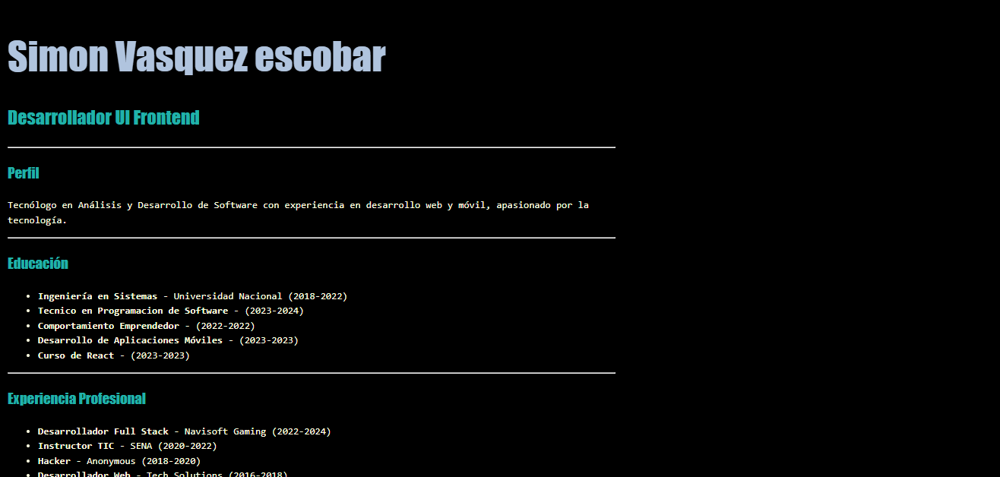
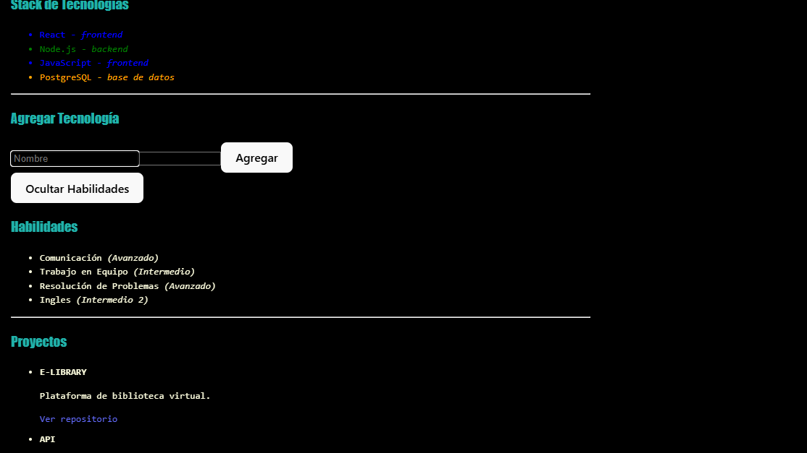

# React + Vite

🧾 CV Dinámico - Simón Vásquez

Este es un proyecto desarrollado como parte de la formación en el SENA para construir una hoja de vida digital utilizando **React** y **Vite**. El proyecto emplea componentes funcionales, estructura modular, **componentes reutilizables con Props**, **manejo de eventos**, y **estado local con useState**. También se incluye control de versiones con Git y publicación en GitHub.

---

## 🖼️ Vista previa

  


---

## 🧑‍💼 Descripción personal

Soy un aprendiz del SENA con conocimientos en desarrollo frontend. Me considero una persona proactiva, responsable y con mucha motivación por aprender y crecer profesionalmente. Este proyecto representa mis primeras prácticas en React y GitHub, incorporando interactividad y uso de estado local para construir interfaces dinámicas.

---

## 🚀 Tecnologías utilizadas

- ⚛️ React
- ⚡ Vite
- 🎨 HTML5 + CSS3
- 🧠 JavaScript (ES6+)
- 🗂️ Git & GitHub

---

## 💡 Habilidades

### Técnicas

- Desarrollo de interfaces web con React
- Componentes funcionales y reutilizables con Props
- Manejo de estado local con `useState`
- Manejo de eventos en React (onClick, onChange, etc.)
- Control de versiones con Git
- Publicación en GitHub

### Blandas

- Trabajo en equipo
- Comunicación efectiva
- Adaptación al cambio
- Pensamiento crítico
- Responsabilidad

---


## 🛠️ Cómo ejecutar este proyecto

1. Clona este repositorio:
```bash
git clone https://github.com/Simonvasquez0811/Cv.git
Entra al directorio del proyecto:

cd cv-simon
Instala las dependencias:

npm install
Ejecuta el proyecto:

npm run dev

##🧩 Funcionalidades Interactivas
Mostrar/ocultar información personal con botones

Cambiar tema del CV dinámicamente

Contadores o estados de visualización

Campos con edición o interacción en tiempo real


